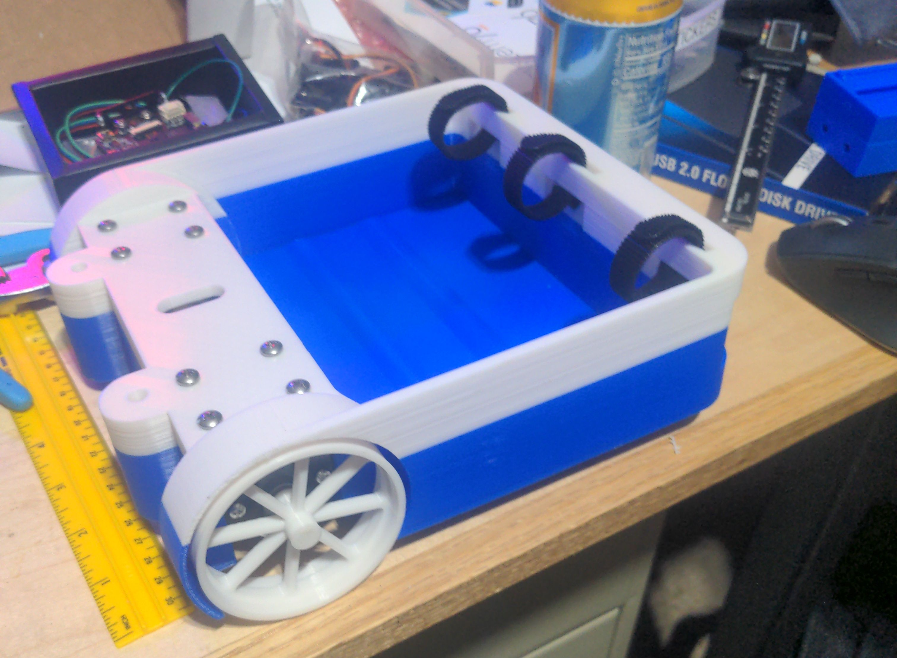
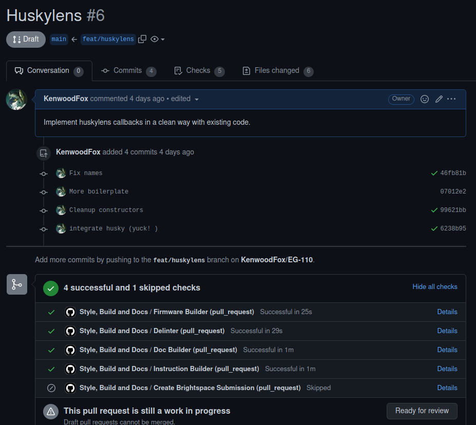
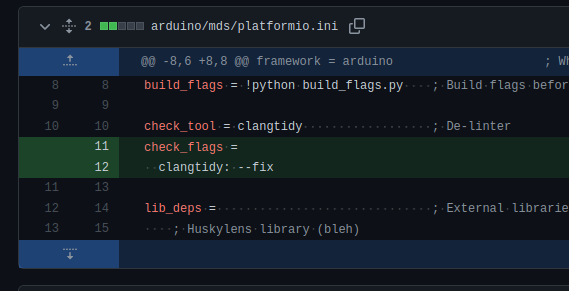
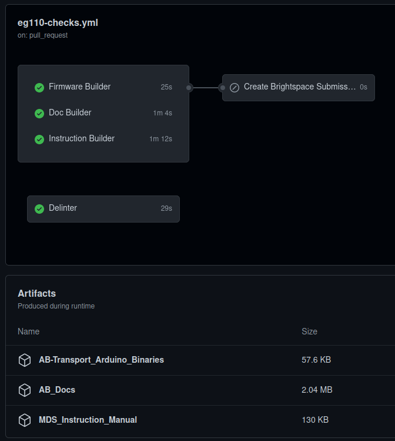

---
title:
 - A-B Transport Project Overview
subtitle:
 - Version &hash
author:
 - Joe
 - Alex
 - James
 - Aiden
institute:
 - SNHU/CETA, EG-110
titlegraphic: ../../resources/TeamLogo.png
theme: Berlin
navigation: frame
date: "Build Date: &date"
aspectratio: 169
logo: resources/TeamLogo.png
fontsize: 8pt
---

# Introduction

## Audience and Purpose

### Audience Characteristics

 - Non-technical people
 - Average martians doing average jobs
 - Might know a little about the basics but not about the advanced features (huskylens)

### Purpose

 - Explain the design problem
 - Design goals
 - Concepts we're considering

## Meet the A-B Transport Team!

::: columns

:::: {.column width=20%}

{ width=90 }  
Alex

::::

:::: {.column width=20%}

{ width=90 }  
James

::::

:::: {.column width=20%}

{ width=90 }  
Joe

::::

:::: {.column width=20%}

{ width=90 }  
Aiden

::::

:::

# Outline

## Project Statement

### Project Statement

 - How can we successfully create a reliable shipping and transport solution that can be relied on by martians?

## Key Design Requirements

### Functional
 - Transport as much as possible.
   - Intentionally vague, strive to make every engineering choice to improve weight capacity.
 - Be as efficient as possible.
 - Prioritize speed and reliability.
 - Prioritize autonomy.

### Physical Requirements

 - Have a sleek, __stackable__ profile. This means our unit should utilize a bounding box space and be as efficient
in its use of standby space as possible.

### Performance Requirements

 - Transport at least 2.5lb for no less than 20m.
 - Perform long distance autonomous routes and have a user operated cycle start/stop sequence.

## Concepts and Selection

::: columns

:::: {.column}

### Mono-chassis

::::

:::: {.column}

### Huskylens

Todo

::::

:::

# Fabrication

## Fabrication Summary

 - We collected COTS robot parts from scrap/old robots.
 - We 3D printed components
 - We machined brackets and misc parts
 - We combined motors and COTS gearbox components into larger components

## 3D Printing

{ height=60% }

Us 3D printing our chassis

## 3D Printing

{ height=60% }

An early assembly of the prototype

## Software

Like hardware, software must be developed in a similar process, prototyping, testing, refining.

::: columns

:::: {.column}

### Pull Requests

{ height=60% }

A pull request is a way to track a feature, and confirm it works before merging it in.

::::

:::: {.column}

### Managing Diffs

{ height=45% }

Each tiny change can be recorded and checked by other team members.

::::

:::

## Automatic Software checks

::: columns

:::: {.column}

{ height=80% }

::::

:::: {.column}

 - By using CI/CD we can automatically check every team member's software contributing before even uploading changes to the arduino firmware.
 - Artifacts can also be downloaded, including things like presentations, arduino **binaries** and other information.

::::

:::

# Conclusion

## Final Prototype

Todo

## Lessons Learned

 - Huskylens library
   - The library was clunky, and poorly maintained. We ended up submitting an issue or two and a pull request on their upstream repo.
 - 3D printing is slow!
   - In total, the 3D printer ran for **55 hours** and used **940** grams in total producing our final prototype, this took forever!

# Questions

## Questions?

 - What
 - Why
 - Who
 - When
 - Where

# Backup Slides

## Backup slides like this one

Beep beep
(Get it? im backing up)
