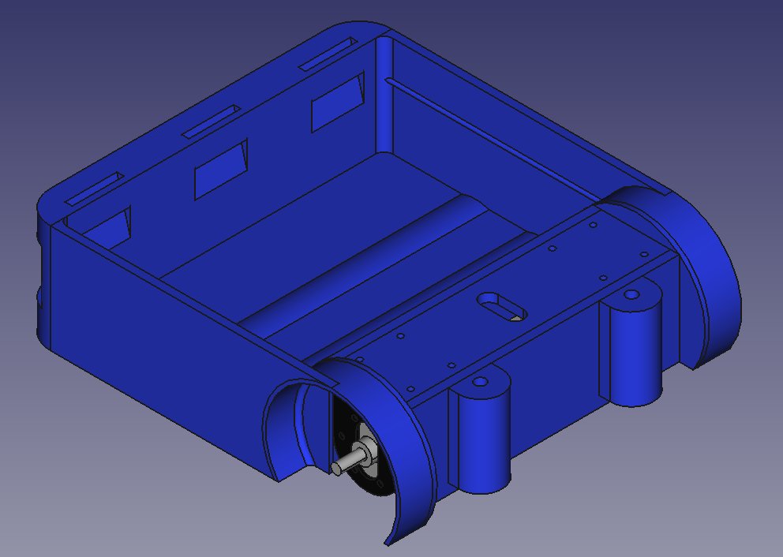
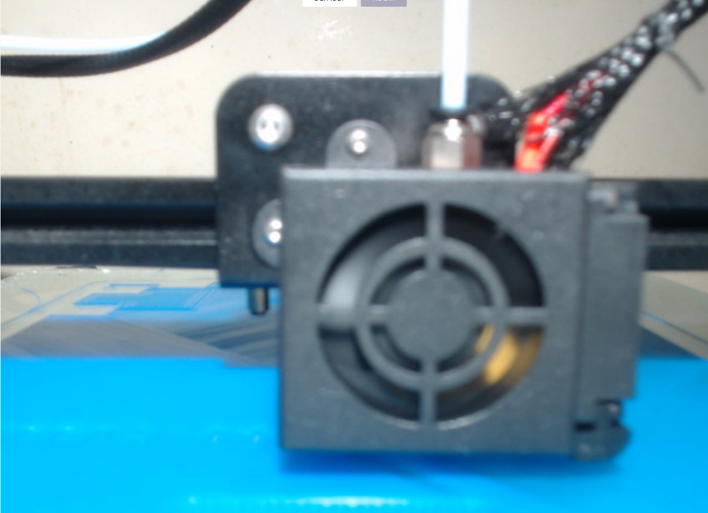

---
title:
 - A-B Transport Project Overview
subtitle:
 - Version &hash
author:
 - Joe
 - Alex
 - James
 - Aiden
institute:
 - SNHU/CETA, EG-110
titlegraphic: ../../resources/TeamLogo.png
theme: Berlin
navigation: frame
date: "Build Date: &date"
aspectratio: 169
logo: resources/TeamLogo.png
fontsize: 8pt
---

# Introduction

## Audience and Purpose

### Audience Characteristics

 - Non-technical people
 - Average martians doing average jobs
 - Might know a little about the basics but not about the advanced features (huskylens)

### Purpose

 - Explain the design problem
 - Design goals
 - Concepts we're considering

## Meet the A-B Transport Team!

::: columns

:::: {.column width=20%}

{ width=90 }  
Alex

::::

:::: {.column width=20%}

{ width=90 }  
James

::::

:::: {.column width=20%}

{ width=90 }  
Joe

::::

:::: {.column width=20%}

{ width=90 }  
Aiden

::::

:::

# Outline

## Project Statement

### Project Statement

 - How can we successfully create a reliable shipping and transport solution that can be relied on by martians?

## Key Design Requirements

### Functional
 - Transport as much as possible
 - Be as efficient as possible
 - Prioritize speed and reliability
 - Prioritize autonomy

### Physical Requirements

Todo

### Performance Requirements

Todo

## Concepts and Selection

::: columns

:::: {.column}

### Mono-chassis

::::

:::: {.column}

### Concept 2

Todo

::::

:::

# Fabrication

## Fabrication Summary

 - We collected COTS robot parts from scrap/old robots.
 - We 3D printed components
 - We machined brackets and misc parts
 - We combined motors and COTS gearbox components into larger components

## 3D Printing

### 3D Printing the Chassis

{ height=50% }

Us 3D printing our chassis

# Conclusion

## Final Prototype

Todo

## Lessons Learned

Todo

# Questions

## Questions?

 - WHAT?
 - WHY
 - WHO
 - WHEN
 - WHERE

# Backup Slides

## Backup slides like this one

Beep beep
(Get it? im backing up)
